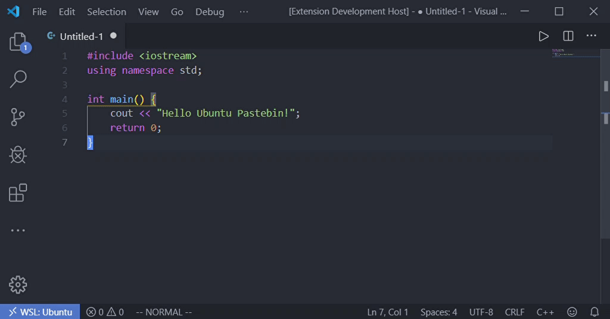

# vscode-ubuntu-pastebin

Upload snippets to [Ubuntu Paste](https://paste.ubuntu.com) from VSCode.

## Features

- Upload the selection or the file to Ubuntu Pastebin, and save the link to the clipboard.

- Automatically recognize the file type of the snippets.

## Usage
- `Upload selection to Ubuntu Pastebin`
- `Upload file to Ubuntu Pastebin`
- `Upload selection to Ubuntu Pastebin with custom poster`
- `Upload file to Ubuntu Pastebin with custom poster`

## Extension Settings

* `vscode-ubuntuPastebin.poster`: The poster name showed on the page.

## Release Notes
See the changelog [here](CHANGELOG.md)